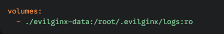
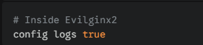

# Evilginx2 Log Automation with n8n

## The Stack:

* **Evilginx2**: The core engine for session hijacking and adversary-in-the-middle attacks
* **n8n**: The "glue" that monitors the logs and handles filtering/logic
* **Docker**: Everything is containerized for easy deployment and cleanup
* **Discord Webhooks**: For instant alerts when someone (you) hits the phishlet

---

## How it works:

1. **Evilginx2** runs in a container and writes its activity logs to a shared volume
2. **n8n** is mounted to that same volume, acting as a log-watcher
3. An **n8n workflow** triggers whenever the log file updates
4. The workflow parses the data, extracts data the "goodies" (tokens/cookies) and pushes a formatted alert to **Discord**

---

### Setup & Deployment:

1. **Shared Volume**:

Make sure both containers can see the log files. In your *docker-compose.yml* , use a shared mount:

2. **n8n Workflow**:

Import the provided JSON (if available) into n8n. The flow should look like this:
* **Read Binary File** (reads the evilginx2.log)
* **Function Item** (parses the new raw text into JSON)
* **Discrod Node** (sends the payload)

3. **Evilginx2 Config**

Ensure your evilginx2 instance is actually writing to the disk:

---

## Disclaimer

This project is for **educational and authorized security testing purposes only.** Using these tools against targets without explicit permission is illegal. Don't be a script kiddie, be a pro.

---